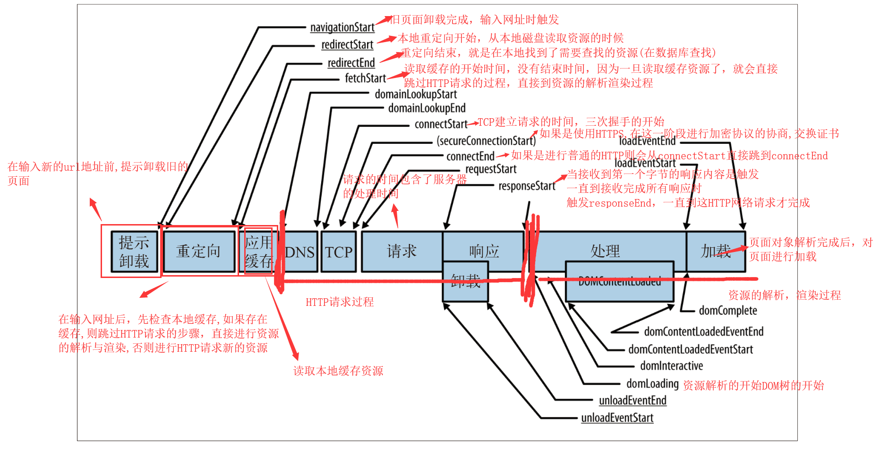
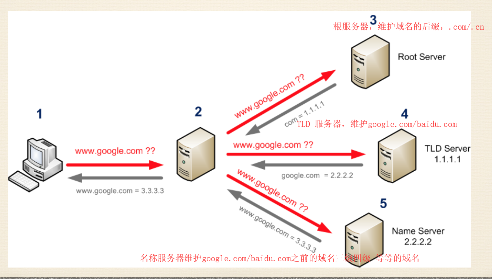
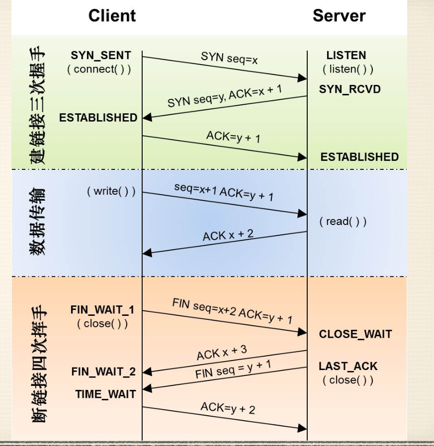

# 前端性能优化

## HTTP 协议(事务)

1. 输入网站并回车
   1. 浏览器检查网络情况,看能不能联网(跨越网关：路由器，代理，家用路由器等等)
2. 解析域名
   1. 解析 DNS(成功的拿到的 IP 地址之后才能够找到目标服务器,因为域名是给人看的 IP 才是给机器看的,所以必须将网址先转换成 IP 地址)
3. 浏览器发送 HTTP 请求
   1. 通过 DNS 解析后拿到了 IP 地址，然后通过一个个网关或路由前往我们需要到达的服务器.服务器可能是一个集群(一个机房大量的服务器,然后找到我们需要的那个服务器)
4. 服务器处理请求
   1. 服务器接受到请求之后，马上对请求进行响应(调用其他服务器拿到你请求的资源)
5. 服务器返回 HTML 响应
   1. 服务器响应通过一个个路由，代理，最后达到初始请求的浏览器(浏览器请求和服务器响应的往返路径不一定相同，因为都是通过跨越一个个网关和路由，并且这些网关跟路由不一定相同)
6. 浏览器处理 HTML 页面
7. 继续请求其他资源

## 浏览器优化 (navigation timing)

### DNS 详解 (浏览器每次都会去请求 DNS 服务器,因为域名是变动的，无法进行缓存)

1. DNS 是 Domain Name System ，域名系统，用于将域名转换为 IP(正向解析)
2. 顶级域名 (google.com) (www.google.com/image.google.com . 二级域名)
3. 域名资源记录
4. 域名服务器 (在进行域名解析的时候向域名服务器发送请求)
5. 域名解析

- 分级查找先由根服务器查找 TLD 服务器(维护后缀) ，再在 TLD 服务器查找名称服务器,再在名称服务器(维护名称)上查找到真正的 IP

### TCP 三次握手四次挥手

- 三次握手：建立链路的机制

1.  客户端向服务器发起请求(谁发起请求谁是客户端，谁被动接受请求谁是服务器端)
2.  服务器收到请求，服务器进行应答，(同时发送自己的请求)(减少一次通信次数)
3.  客户端收到服务器的应答和请求后，客户端再应答服务器的请求(这样就建立了可通信的 TCP 链接)

- 数据传输阶段:反复地来回通信(多次的来回通信)
- 四次挥手：断开链路的机制(服务器不能主动断开链接，所有指令都得有客户端发起)

1.  客户端发起断开请求指令
2.  服务器端进行响应(表示服务器端收到了客户端发起的断开指令，避免响应超时)(半断开)
3.  服务器发起一个断开指令(为什么这里会多一次挥手:因为服务器在响应客户端发起的断开指令时，需要将在服务器的工作结束掉，然后才能告诉客户端我这边的工作完成了，可以断开链接了)
4.  客户端接受到由服务器发起的断开指令(这时候断开才完成)

如果握手和挥手只进行了一半，那么就会变成半连接状态，导致资源(**端口资源、维护端口的内存资源**)释放不掉造成 TCP 堆的崩溃,导致服务器内存不足,最终导致服务器崩溃(**DDOS攻击:短时间内发送大量的半连接请求，解决:堆硬件**)

### CDN(镜像服务器)

## 服务器优化
