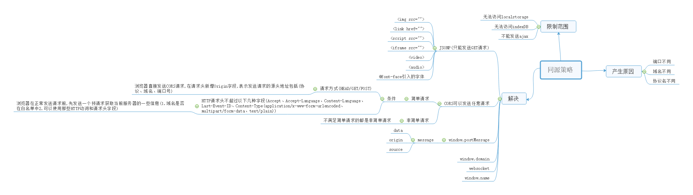

# 同源策略



## 含义

A 网页设置的 Cookie，B 网页不能打开，除非这两个网页"同源"
同源指"三个相同"

1. 协议相同
2. 域名相同
3. 端口相同
   举例来说，http://www.example.com/dir/page.html 这个网站，协议是http://，域名是www.example.com,端口是80(默认端口,可以省略)。他的同源情况

- http://www.example.com/dir2/other.html：同源
- http://example.com/dir/other.html：不同源（域名不同）
- http://v2.www.example.com/dir/other.html：不同源（域名不同）
- http://www.example.com:81/dir/other.html：不同源（端口不同）

## 目的

同源策略的目的是为了保证用户信息的安全，防止恶意的网站窃取数据

## 限制范围

1. Cookie,Localstorage 和 IndexDB 无法读取
2. DOM 无法获得
3. AJAX 请求不能发送

# Cookie

Cookie 是服务器写入浏览器的一小段信息,只有同源的网页才能共享。但是,如果两个网页一级域名相同,只是二级域名不同,浏览器允许通过设置 document.domain 共享 Cookie.
举例来说，A 网页是http://w1.example.com/a.html，B网页是http://w2.example.com/b.html，那么只要设置相同的document.domain，两个网页就可以共享Cookie。

```
    document.domain="example.come"
```

## 注意,这种方法只适用于 Cookie 和 iframe 窗口,Localstorage 和 IndexDB 无法通告这种方法规避同源策略。

而是要通过 h5 新加的 postMessage 这个 API 。
另外,服务器也可以在设置 Cookie 的时候,置顶 Cookie 的所属域名为一级域名,比如 .example.com

```
    Set-Cookie:key=value;domain=.example.com;path=/
```

这样的话,二级域名和三级域名不用做任何设置,都可以读取这个 Cookie

# iframe

如果两个网页不同源,就无法拿到对方的 DOM。典型的例子是 iframe 窗口 和 window.open 方法打开的窗口,他们与父窗口无法通信
例子

```
    //父窗口获取子窗口内容
    document.getElementById("myIFrame").contentWindow.document //报错
    //子窗口获取父窗口内容
    window.parent.document.body//报错
```

如果两个窗口一级域名相同,只是二级域名不同。就可以通过设置 document.domain ,规避同源政策 ，拿到 DOM
对于完全不同源的网站,目前有三种方法,可以解决跨域窗口的通信问题

1. 片段识别符(fragment identifier)
2. window.name
3. 跨文档通信 API(Cross-document messaging)

# window.postMessage

h5 引入的新的 API,运行跨窗口通信,不管同源非同源
otherWindow.postMessage(message, targetOrigin, [transfer]);
message 的属性有

1. data
   从其他 window 中传递过来的对象
2. origin
   调用 postMessage 是消息发送方窗口的 origin(https://example.org)
3. source
   对发送消息的窗口对象的引用,您可以使用次来在具有不同 origin 的两个窗口之间建立通信

## 安全问题

1. 如果不希望从其他网站接收 message ,就不要监听 message (window.addEventListener("message",function(e){}))
2. 如果确实希望接收 message,那么始终使用 origin 和 source 属性验证发件人的身份
3. 使用 postMessage 发送数据时,始终指定精准的目标 origin,而不是 \* .

# LocalStorage

可以通过 window.postMessage 读写其他窗口的 LocalStorage

# AJAX

同源策略规定,AJAX 请求只能发给同源的网址,否则报错
除了使用服务器代理来规避同源 ,还有另外三种方法

1. JSONP
2. WebSocket
3. CORS

## JSONP (script img link iframe 都不受同源策略的影响 )

基本思想是,通过动态添加一个<script></script>元素,向服务器发送 JSON 请求,然后服务器在收到请求后,将数据放在一个指定名字的回调函数(callback)中返回

```
    function addScriptTag(src) {
        var script = document.createElement('script');
        script.setAttribute("type","text/javascript");
        script.src = src;
        document.body.appendChild(script);
    }
    window.onload = function () {
        addScriptTag('http://example.com/ip?callback=foo');
    }
    function foo(data) {
        console.log('Your public IP address is: ' + data.ip);
    };
```

同时 服务器需要对 callback 的 函数名进行监听,为了返回数据。
但是 JSONP 只能发送 get 请求,就是把请求参数放在 url 上。

## WebSocket

## CORS

(Cross-Origin Resource Sharing)缩写 。允许发送任意请求

### 简介

CORS 需要浏览器和服务器同时支持。目前,所以浏览器都支持,但是 IE 不能低于 IE10。
CORS 通信与同源的 AJAX 通信没有差别,代码完全一样。浏览器一旦发现 AJAX 请求夸员,就会自动添加一些附加的头信息,有事还会多出一次附加的请求(预请求)。
因此,实现 CORS 通信的关键是服务器。

### 两种请求

浏览器将 CORS 请求分为两种:简单请求和非简单请求。

#### 简单请求条件(同时满足)

1. 请求方法是一下三种之一

- HEAD
- GET
- POST

2. HTTP 的头信息不超过以下几种字段

- Accept
- Accept-Language
- Content-Language
- Last-Event-ID
- Content-Type:(只限于三个值) application/x-www-form-urlencoded、multipart/form-data、text/plain

#### 非简单请求

不满足以上条件的都是非简单请求
浏览器对这两种请求的处理是不一样的。

### 简单请求

浏览器直接发出 CORS 请求。就是在头信息中增加一个 Origin 字段
例子:

```
GET /cors HTTP/1.1
Origin: http://api.bob.com
Host: api.alice.com
Accept-Language: en-US
Connection: keep-alive
User-Agent: Mozilla/5.0...
```

Origin 字段是一个完整的请求地址,包括(协议、域名、端口)。

1. 服务器设置

- Access-Control-Allow-Origin // 表示允许请求的域名 \* 号表示允许所以域名请求
- Access-Control-Allow-Credentials // Boolean 值,表示是否允许发送 Cookie
- Access-Control-Expose-Headers //

2. 浏览器设置(AJAX 请求中)

- withCredentials // Boolean 允许发送 Cookie
  注意: 当要发送 Cookie 时,Access-Control-Allow-Origin 不能为\*.因为只有用服务器域名设置的 Cookie 才会上传,其他域名的 Cookie 并不会上传

### 非简单请求 (OPTIONS 请求)

非简单请求是那种对服务器有特殊要求的请求.比如 PUT 和 DELETE,或者 Content-Type 字段类型是 application/json.
非简单请求会在正式通信之前增加一次预请求(1.当前网页所在的域名是否在服务器的许可名单之中。2.可以使用那些 HTTP 动词和头信息字段)

1. 预请求

```
OPTIONS /cors HTTP/1.1
Origin: http://api.bob.com
Access-Control-Request-Method: PUT
Access-Control-Request-Headers: X-Custom-Header
Host: api.alice.com
Accept-Language: en-US
Connection: keep-alive
User-Agent: Mozilla/5.0...
```

除了 Origin 字段,预请求其他特殊字段

- Access-Control-Request-Method //必须 列出浏览器的 CORS 请求会用到那些 HTTP 方法(GET,HEAD,PUT,POST,DELETE,PATCH,OPTIONS)
- Access-Control-Request-Headers //指定浏览器 CORS 请求会额外发送的头信息字段
- Access-Control-Allow-Credentials // Boolean 允许发送 Cookie
- Access-Control-Max-Age // 本次预请求的有效期

# 参考

- [浏览器同源政策及其规避方法](http://www.ruanyifeng.com/blog/2016/04/same-origin-policy.html)
- [postMessage](https://developer.mozilla.org/zh-CN/docs/Web/API/Window/postMessage)
- [CORS](http://www.ruanyifeng.com/blog/2016/04/cors.html)
