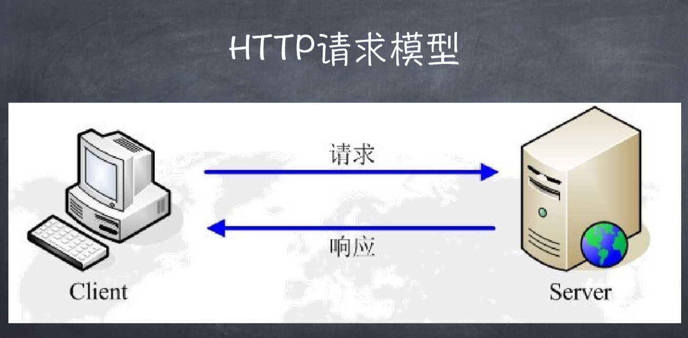
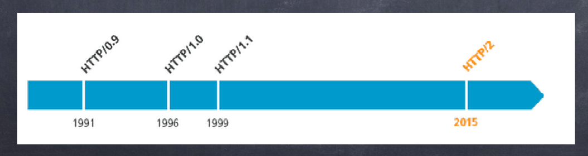
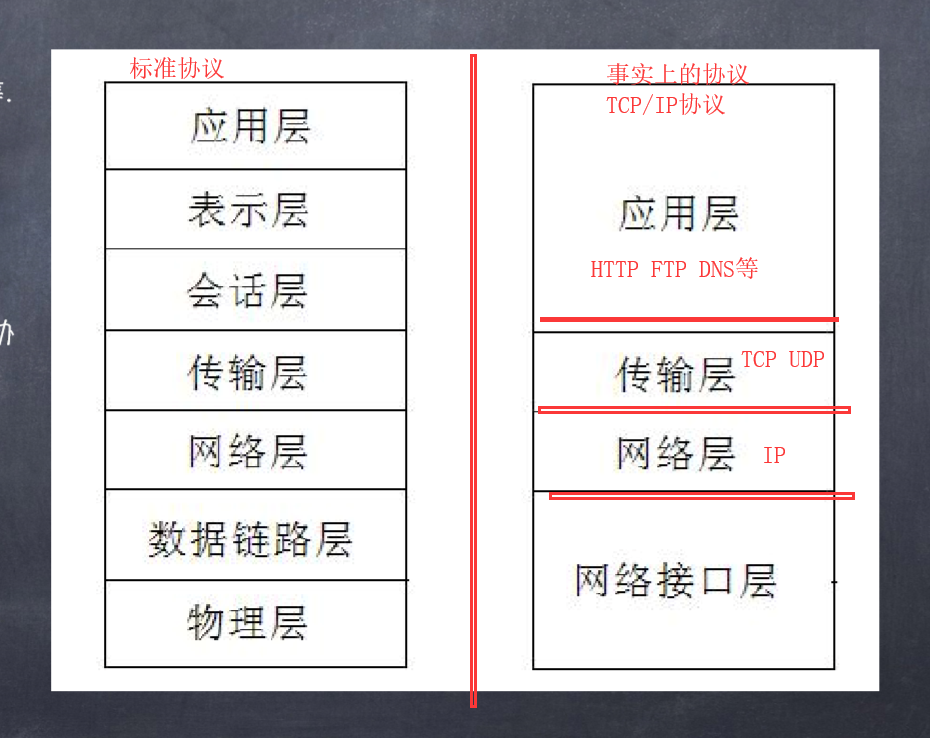
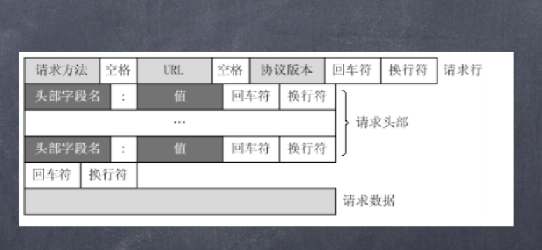
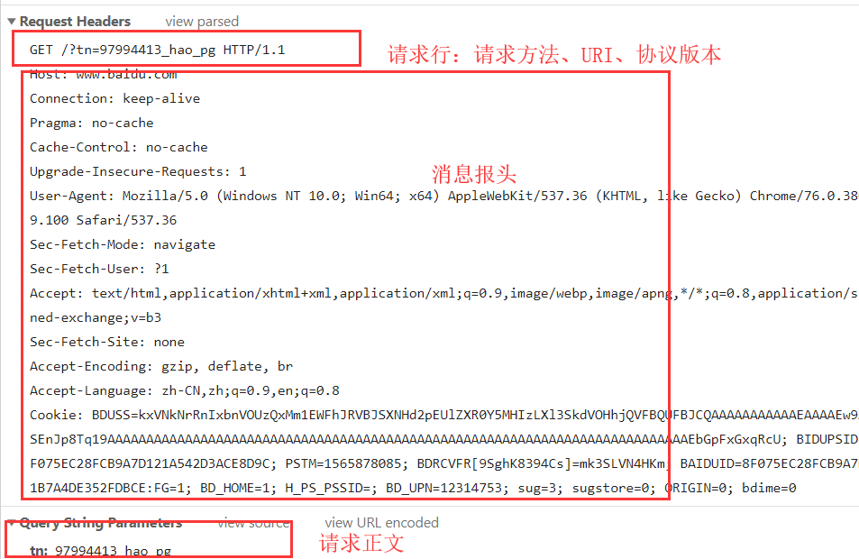
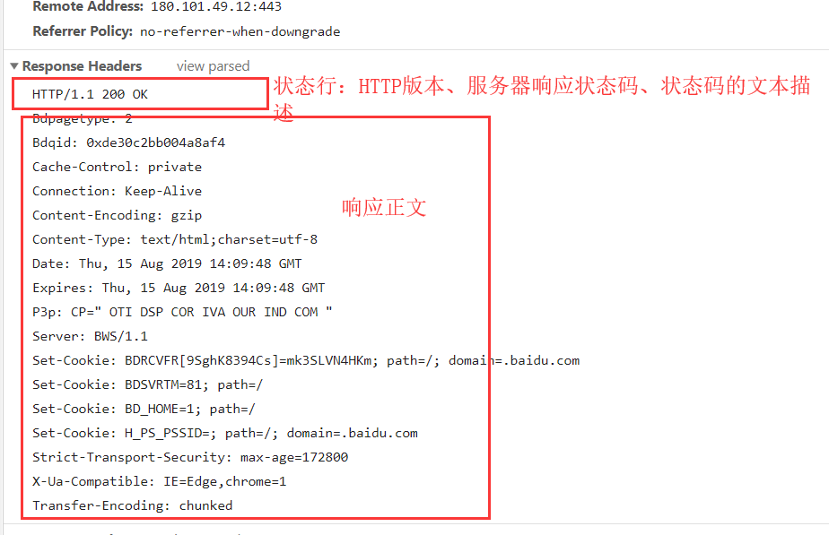
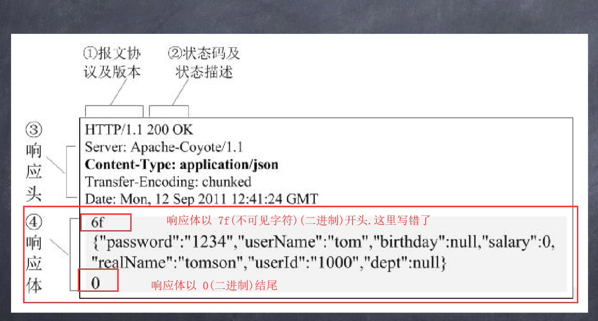
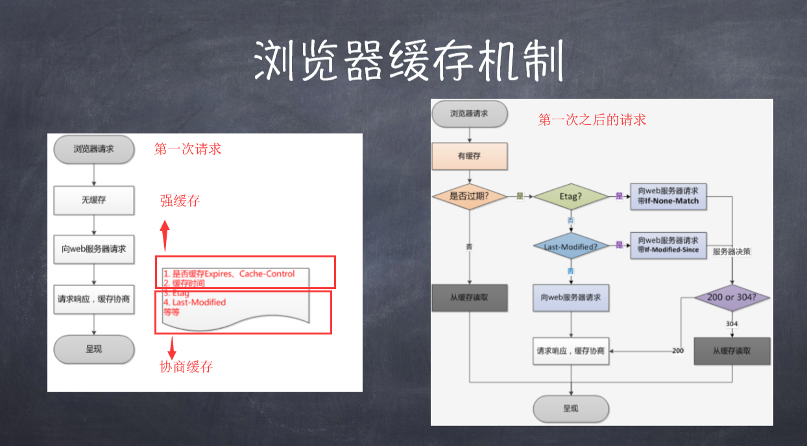

# http 协议

## 浏览器行为与 http 协议

- 处理流程

1. 输入网址并回车
2. 解析域名
3. 浏览器发送 http 请求
4. 服务器处理请求
5. 服务器返回 HTML 响应
6. 浏览器处理 HTML 页面
7. 继续请求其他资源

- 发送请求前：先跨越内外网的限制(互联网是外网,家里或者局域网属于内网)路由器或者是家用的猫(遵循一种 ppp 协议)
- 打开浏览器输入网址：将网址翻译成 ip 地址(解析域名),通过 DNS 服务器,找到真正要访问的 IP 地址
- 进行请求后：到了服务器机群,多个服务器共用一个 IP(通过反向代理完成)
- 服务器响应：
- 浏览器收到返回数据：浏览器渲染 HTML 页面

## 什么是 http 协议(超文本传输协议,从 www 服务器传输到本地浏览器的一种传输协议)

- http 协议是由从客户端到服务器的请求和从服务器到客户端的响应进行约束和规范
  

1. 应用层：为用户提供所需要的各种服务(HTTP,FTP,DNS,SMTP 等)
2. 传输层：
   - 传输控制协议(TCP)：一种靠谱的协议,只要它负责的就一定会完成
   - 用户数据报协议(UDP)：一种不靠谱协议 ,只负责发送,不管内容发没发到它不管
3. 网络层：解决主机到主机的通信问题
4. 网络接口层：负责监视数据在主机和网络之间的交换

- http 默认端口 80,https 默认端口 443

## HTTP 的工作过程

- 一次 HTTP 操作称为一个事务,其工作过程可分为四步：(事务表示一系列事情是串行完成,其中一步失败,这次操作就算失败)

1. 首先客户端与服务器需要建立连接
2. 建立连接后,客户端发送一个请求给服务器
3. 服务器接到请求后,给予相应的响应信息
4. 客户端接收服务器返回的信息通过浏览器显示在显示屏上(浏览器的渲染),然后客户端与服务器断开连接,如果不断开连接会产生一系列的问题

## 请求和响应

1. HTTP 请求组成：请求行、消息报头、请求正文

- 请求行组成：以一个方法符号开头,后面跟着请求的 URI 和协议版本
  

2. HTTP 响应组成：状态行、消息报头、响应正文

- 状态行组成：服务器 HTTP 协议的版本,服务器返回的响应状态码和状态码的文本描述
  
  

- http 是纯文本协议。与之对应的是二进制协议(http2 使用二进制协议)

## 请求方法

1. GET: 请求获取 Request-URI 所标识的资源 (GET 方法不附加请求体)
2. POST: 在 Request-URI 所标识的资源后附加新的数据 (POST 方法会附加请求体)
3. HEAD: 请求获取由 Request-URI 所标识的资源的响应消息报头
4. PUT: 请求服务器存储一个资源，并用 Request-URI 作为其标识
5. DELETE: 请求服务器删除 Request-URI 所标识的资源
6. TRACE: 请求服务器回送收到的请求信息，主要用于测试或诊断
7. CONNECT: HTTP/1.1 协议中预留给能够将连接改为管道方式的代理服务器。
8. OPTIONS: 请求查询服务器的性能，或者查询与资源相关的选项和需求

## HTTP 状态码

1. 1xx:指示信息--表示请求已接收,继续处理
2. 2xx:成功--表示请求已被成功接收、理解、接收
   1. 200:表示从客户端发来的请求在服务器端被正常处理(OK)
   2. 204:表示服务器接收的请求已成功处理,但在返回的响应报文中不含实体的主体部分(No Content)
   3. 206:表示客户端进行了范围请求,而服务器成功执行了这部分的 GET 请求(Partial Content)
3. 3xx:重定向--要完成请求必须进行更进一步的操作
   1. 301:永久重定向(Moved Permanently)
   2. 302:临时重定向(Moved Temporarily)
4. 4xx:客户端错误--请求语法错误或请求无法实现
   1. 400: 表示请求报文中存在语法错误(Bad Request)
   2. 401:表示发送的请求需要有通过 HTTP 认证的认证信息(Unauthorized)
   3. 403:表示对请求资源的访问被服务器拒绝了(Forbidden)
   4. 404:表示服务器上无法找到请求的资源 (Not Found)
5. 5xx:服务器错误--服务器未能实现合法的请求
   1. 500:表示服务器端在执行请求是发生了错误(Internal Server Error)
   2. 503:表示服务器暂时处于超负载或正在进行停机维护(Service Unavailable)

## 常见的请求报头

- Accept: 表示客户端支持的数据格式,或者说客户端"希望"接收到的内容类型
- Accept-Encoding: 表示客户端所支持的解码格式
- Accept-Charset:表示客户端可接受的字符集
- Accept-Language:表示客户端可接受的语言
- Authoriztion: 主要用于证明客户端有权查看某个资源
- Host:用户指定被请求资源的 Internet 主机和端口号
- User-Agent:表示用户所使用的浏览器名称和版本和当前机器的信息
- Referer: 表示当前请求是从哪个资源发起的,或者是请求的上一步的地址.通常用于网站的访问统计,因为我们可以知道当前网站的是由哪个网站跳转过来的.
- If-Modified-Since: 表示客户端缓存文件的时间,客户端读取字段值,判断服务器端文件的最后修改时间,如果不晚于该值,则说明浏览器缓存的文件是最新的,然后就不会重新发送文件内容,而是将相应报文的状态设置为 304,表示浏览器可以继续使用缓存的文件,达到节省带宽的目的
- If-None-Match:该字段同 If-Modified-Since 字段一样,都用来表示自愿文件是否是最新的.只不过 If-Match-Since 表示文件的最后修改时间。Last-Modified/If-Modified-Since 和 Etag/If-None-Match 这两对头字段都是用来标记缓存资源的,并且后者的优先级要高于前者
- Cache-Control: 字面意思为"缓存-控制",前面的几个字段表明客户端/服务器如何使用缓存机制,而这个字段就是用来控制缓存的
  1. no-store ；表示浏览器不需要缓存本次的内容(_优先级比 Etag 和 Last-Modified 高_)
  2. max-age : 表示接下来的时间内,浏览器可以自主使用缓存内容,不需要想服务器发送同意的请求
  3. no-cache : 表示如果返回给我缓存文件时,需要向服务器进行确认,缓存是不是最新的
- Vary:接受的编码格式

## 常见的响应报头

- Content-Length:表示接收到的响应报文的总长度
- Content-Type:响应正文的类型
- Content-Encoding:响应正文的数据压缩格式
- Content-Charset:响应正文的编码
- Content-Length:响应正文的长度
- Server:服务器名称
- Accept-Ranges:服务器所支持的内容范围
- Cache-Control:通知从服务器到客户端内的所有缓存机制,表示他们可以缓存这个对象的有效时间,单位秒
- Date:词条消息被发送的日期和时间
- ETag:某个资源的某个特定版本的标识符
- Expires：指定一个日期/时间,超过该时间则认为此回应已经过期
- Last-Modified:锁清秋的对象的最后修改日期
- Set-Cookie:设置 Cookie

## cookie 和 session(用来识别用户)**http 是一种无状态协议,无法保存用户信息**

- cookie 是保存在客户端的小段文本,随客户端每一个请求发送该 url 下的所有 cooikes 到服务器端(**用来识别用户**)
  - 一般情况下是服务器下发的
  - 在特定情况下也可以通过特定的 API 来修改 cookie
  - 与 cookie 相关的报文头字段 Set-Cookie/Cookie
  - cookie 不可跨域名性(网站只能操作自己域名下的 cookie,即 google 不能操作 baidu 的 cookie)
  - cookie 具有有效期(秒)
    - 为负数时: 该 cookie 尽在本窗口以及子窗口有效,关闭窗口后该 coolie 失效**为临时 cookie**
    - 为 0 时:表示删除该 cookie.cookie 没有删除机制,设置有效期为 0 来实现删除 cookie 的效果
  - cookie 的修改、删除:cookie 不提供修改删除操作,只能通过新建一个同名 cookie 来实现修改.通过设置有效期时间为 0 来实现删除 cookie，**同时该 cookie 的其他属性也必须跟原 cookie 相同,才能实现想要的效果,否则会修改/删除失败**
  - cookie 可以设置路径(path)、安全(secure)属性(只在 HTTPS 的 SSL 层使用)
- session 则保存在服务器端,通过唯一的 sessionID 来区分每一个用户 SessionID 随每个链接请求发送到服务器,服务器根据 sessionID 来识别客户端(服务器会通过一个"用户明细表"来检索)

  - session 的生命周期:session 存储在服务器上,为了提高存储速度,一般会存放在内存中,如果内容过大,可能会导致内存溢出,所以只存储精简信息
  - session 的有效期:如果存在 session 的超时时间,session 会删除掉长时间没有访问的 session

    - 对不支持 cookie 的客户端的解决,使用**URL 地址重写**移动端浏览器就不支持 cookie

_cookie 和 session 分不同的场景使用_
**如果考虑到安全则使用 session,如果考虑服务器压力则使用 cookie**

## HTTP 缓存机制(浏览器缓存)

- 目的：提高访问速度
- 如果把所有资源全部放到服务器上去,服务器压力会很大
  1. 存储压力(内存)
  2. 网络输出压力(IO)
  3. 预算压力
- 优点
  1. 减少响应延迟
  2. 减少网络带宽消耗
- 第一次请求某个资源时,服务器必定返回资源,当第一次之后再次请求同样的资源时,就会启用缓存策略,

## 浏览器缓存机制

1. 缓存位置
   - Service Worker:运行在浏览器背后的独立线程**传输协议必须是 HTTPS**
   - Memory Cache:内存缓存,读取高效,但是缓存持续性较短,随着进程的释放而释放
   - Disk Cache:硬盘缓存,读取速度慢,存储容量大于内存缓存
     - 大文件或者使用率不高的资源使用 Disk Cache
     - 小文件或者使用率高的资源使用 Memory Cache
   - Push Cache
2. 缓存过程
   - 通过第一次请求时返回的响应头来确定
3. 强缓存:不会向服务器发请求,而是直接从缓存中读取资源

- 报文字段
  1. Expires(HTTP/1):缓存过期时间,是服务器上的具体时间,受限于本地时间,如果手动修改了本地时间,会造成缓存失效
  2. Cache-Control(HTTP/1.1):用于控制网页缓存

* Expires 和 Cache-Control 的对比
  - 两者同时存在时,Cache-Control 优先级高,而 Expires 是对某些不支持 HTTP/1.1 的浏览器做的兼容处理
* 强缓存是通过一个时间或者是一个时间段来判断资源是否过期,但是如果某个资源在有效期内更新了,使得强缓存失效了,那么就需要使用协商缓存

4. 协商缓存:在强缓存失效后的处理
   - 在强缓存失效后,浏览器携带缓存标识向服务器发起请求,
   - 报文字段分为两种**成对出现**
     1. Last-Modified/If-Last-Modified
        - 第一次请求时,响应头添加
        - 下一次请求时,请求头检测到了字段,服务器对比值,进入不同的流程(返回 200 或者是 304)
        1. Last-Modified 弊端
           1. 本地打开缓存文件,即使资源没有修改,但还是会造成 Last-Modified 修改,服务器不能命中缓存导致重复发送资源
           2. Last-Modified 以秒为单位,如果在某个极短的时间内修改了,服务器还是会认为资源命中了,不会返回正确的资源
           - 为了解决这个问题,在 HTTP/1.1 出现了 Etag/If-None-Match
     2. Etag/If-None-Match
        - Etag 是在第一次请求资源时,服务器返回的一个唯一标识
        - 下一次请求时,请求头通过 If-None-Match 字段将上一次返回的 Etag 发送到服务器,服务器对比当前的 Etag,如果命中则返回 304,否则 200 重写请求资源(同时将新的 Etag 返回)
     - Last-Modified/If-Last-Modified 跟 Etag/If-None-Match 对比
       1. 精确度:Etag 优于 Last-Modified
       2. 性能:Etag 逊于 Last-Modified,Last-Modified 只记录时间,而 Etag 需要在服务器计算一个 hash 值
       3. 优先级:服务器校验优先考虑 Etag
5. 缓存机制

- 强缓存优先协商缓存,若强缓存失效才会使用协商缓存,如果连协商缓存也失效了,那么服务器会重新返回资源和缓存标识

6. 使用场景

- 频繁变动的资源:使用`Cache-Control:no-cache`,同时配合 Etag 和 Last-Modified
- 不常变动的资源:使用`Cache-Control:max-age=xxxxxx`

> 参考

- [http 报文](https://blog.csdn.net/qq_31869107/article/details/89339626)
- [cookie 和 session](https://www.cnblogs.com/liuwei0824/p/7699632.html)
- [浏览器缓存机制](https://www.jianshu.com/p/54cc04190252)
