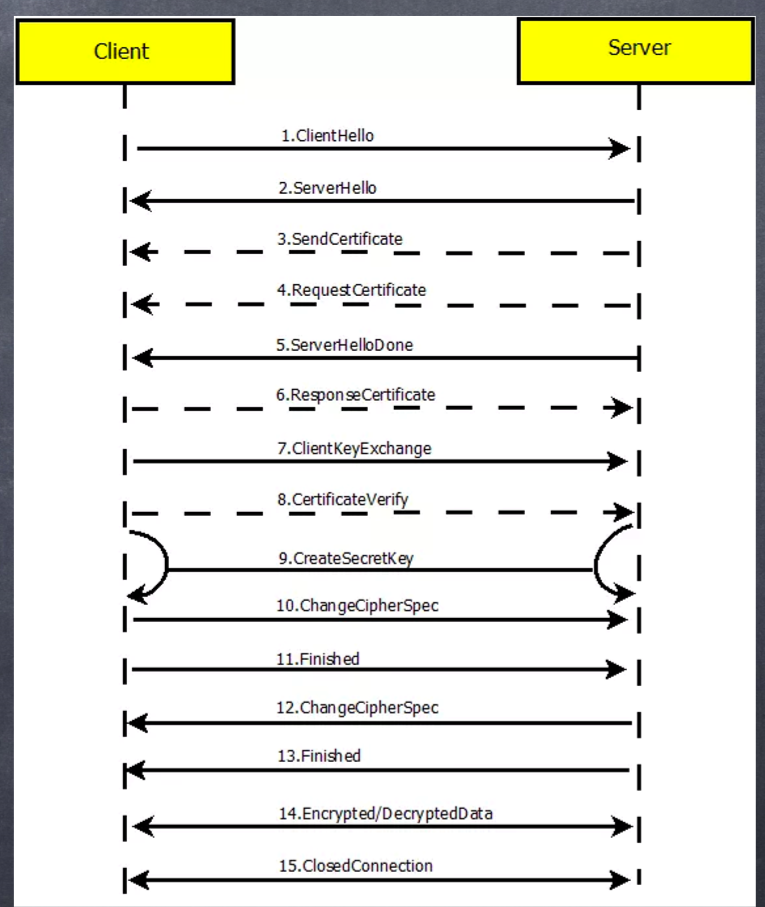
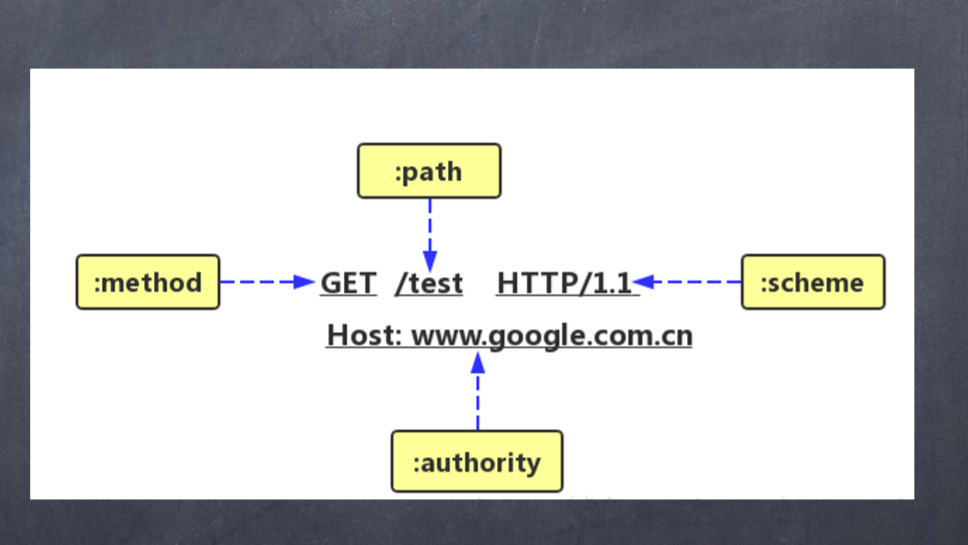
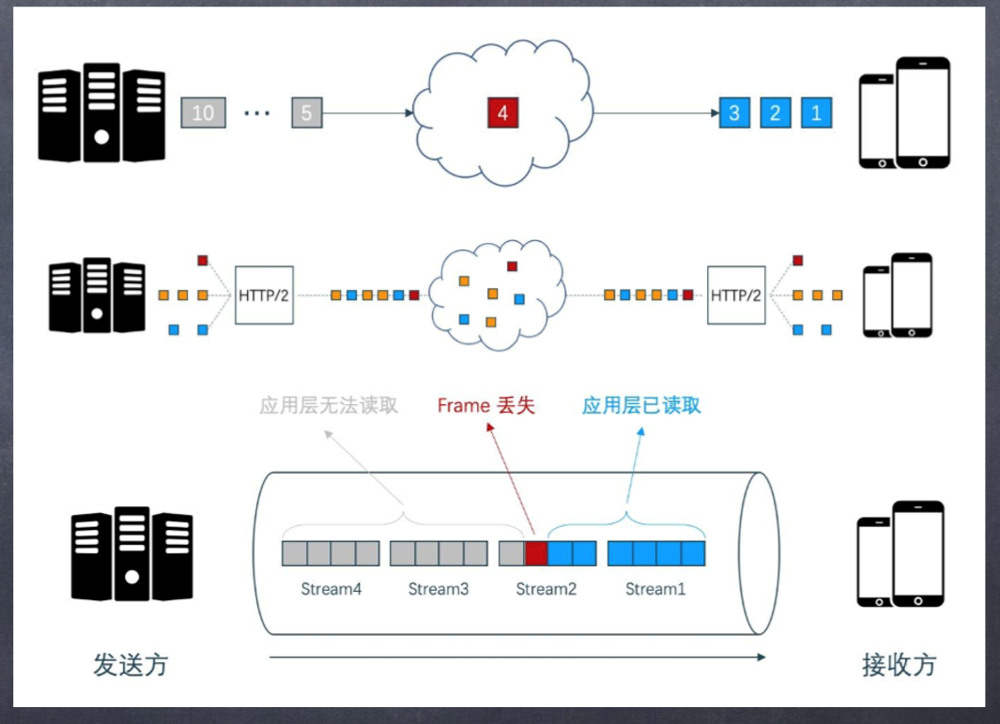
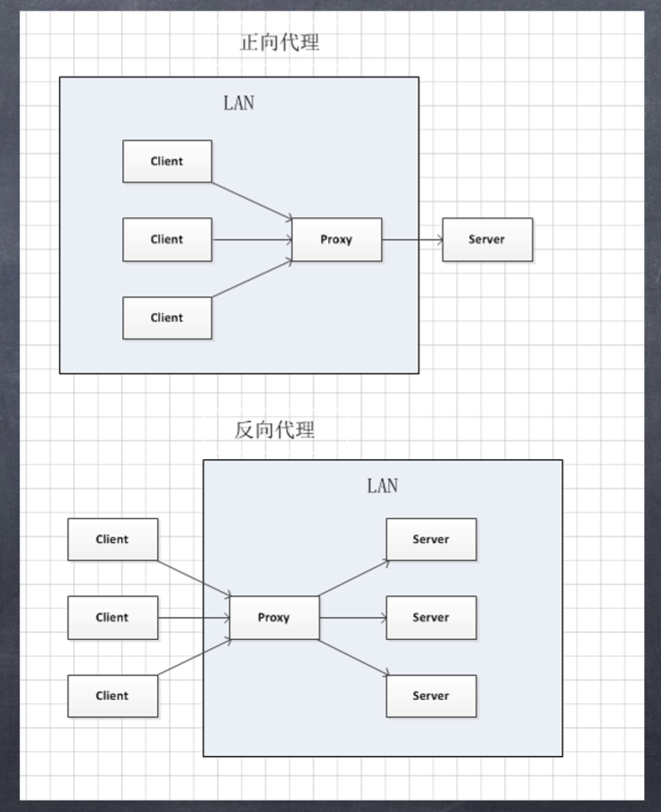

# http 协议

## 密码学

### 对称加密(AES、DES、3DES)

- 明文 + 加密算法 => 秘文
- 秘文 + 加密算法 => 明文

### 非对称加密(RSA 生成公钥和私钥)

- 公钥:用来加密
- 私钥:用来解密

### 密钥交换算法(diffie-Hellman 密钥协商算法 --对称加密)

1. A 和 B 确定两个大素数 n 和 g,不用保密
2. A 选择另一个大随机数 x,并计算 b : a = gx mod n
3. A 将 a 发给 B
4. B 同样的选择另一个大随机数 y:并计算 b: b = gy mod n
5. B 将 b 发给 A
6. 计算密钥 k1 k1 = Bx mod n
7. 计算密钥 k2 k2=Ay mod n
8. k1=k2，因此 A 和 B 可以用其进行加解密

### 证书签发机构(CA:certification authority)

- 是数字证书的签发机构.作为权威机构,其审核申请者身份后,签发证书,这样我们只需要校验数字证书即可确定对方的真实身份

### SSL/TLS 协议

- 传输层安全性协议(Transport Layer Security- TLS),及其前身安全套接层(Secure Sockets Layer-SSL)是一种安全协议,目的是为互联网通信提供安全及数据完整性保障
- HTTPS 协议的安全性由 SSL 协议实现,当前使用的 SSL 协议 1.2 版本包含了四个核心协议:握手协议、密钥配置切换协议、应用数据协议及报警协议
  <!-- - HTTPS协议、SSL协议、TLS协议、握手协议的关系 -->

## HTTPS 协议分析

### TLS 握手的步骤

1. ClientHello:客户端发送所支持的 SSL/TLS 最高协议版本号和所支持的加密算法集合及压缩方法集合给服务器端
2. ServerHello:服务器端收到客户端信息后,选定双方都能够支持的 SSL/TLS 协议版本和加密方法及压缩方法返回给客户端
3. SendCertificate(可选):服务器端发送服务器证书给客户端
4. RequestCertificate(可选):如果选择双向验证,服务器端向客户端请求客户端证书
5. ServerHelloDone:服务器通知客户端初始协商结束
6. ResponseCertificate(可选):如果选择双向验证,客户端向服务器端发送客户端证书
7. ClientKeyExchange:客户端使用服务器端的公钥,对客户端公钥和密钥种子进行加密,再发送给服务器端
8. CertificateVerify(可选):如果选择双向验证,客户端用本地私钥生成数字签名,并发送给服务器端,让其通过收到的客户端公钥进行身份验证
9. CreateSecretKey:通讯双方基于密钥种子等信息生成通信密钥
10. ChangeCipherSpec:客户端通知服务器端已将通讯方式切换到加密模式
11. Finished:客户端做好加密通讯的准备
12. ChangeCipherSpec:服务器端通知客户端已将通讯方式切换到加密模式
13. Finished:服务器做好加密通讯的准备
14. Encrypted/DecryptedData:双方使用客户端密钥,通过对称加密算法对通讯内容进行加密
15. ClosedConnection:通讯结束,任何一方发出断开 SSL 链接的消息

## HTTP/1.x

### 缺陷

1. 链接无法复用:导致每次请求都经历三次握手和慢启动
   1. HTTP/1.0 传输数据是,每次都需要重新建立链接,增加延迟
   2. HTTP/1.1 虽然加入了 keep-alive 可以复用一部分链接,但在某种情况下仍然需要建立多个 connection,耗费资源,给服务器带来性能压力
2. 栈首阻塞(_Head-Of-Line Blocking(HOLB)_):当页面需要请求很多资源的时候,只有当之前的资源处理完毕之后,后续的资源才会开始发起请求
   1. HTTP/1.0:下个请求必须在前一个请求返回后才能发出,请求跟响应按序发生,如果某个请求长时间没有返回,那么接卸来的请求全部阻塞
   2. HTTP/1.1:尝试使用 pipeling(管道化)来解决,即浏览器可以一次性发出多个请求(同域名,同 TCP 链接).但 pipeline 返回是按序的,如果某个请求很耗时,后续的其他请求即使已经处理完成,仍然需要等待前面的请求处理完成才开始返回(只部分解决了 HOLB)
3. 协议开销大:HTTP/1.x 在使用时,header 携带了大量基本没有变化的内容,在一定程度上增加了传输的成本
4. 安全因素: HTTP/1.x 在传输数据时,所以传输内容都是明文,客户端和服务器无法验证对方的身份,在一定程度上无法保证数据的安全性

## HTTP/2

1. 主要目标是通过支持完整的请求与响应复用来减少延迟,通过有效压缩 HTTP 表头字段将协议开销降至最低,同时增加对请求优先级和服务器推送的支持.**新的流控制、错误处理和升级机制**
2. HTTP/2 没有改动 HTTP 的应用语义**HTTP 方法、状态码、URI 和标头字段一如往常**
3. HTTP/1.x 使用的是文本来进行传输数据.HTTP/2 引入了一个新的二进制分帧层(就是使用二进制格式来传输数据),无法与之前的 HTTP/1.x 服务器和客户端向后兼容,因此协议的主版本提升到 HTTP/2
4. 多路复用: HTTP/2 引入了多路复用的技术,解决了浏览器限制同一个域名下的请求数量问题
5. Header 压缩
6. 服务器主动推送(不再是先将页面骨架请求过来解析完成后,在陆续请求页面骨架所使用的的资源,而是在请求页面骨架的同时,服务器主动将页面骨架所使用的的资源推送过来,**解决了 HOLB 栈首阻塞问题**)
7. 默认使用加密(**二进制分帧层**)

### 多路复用

- 在 HTTP/1 中,客户端会建立多个 TCP 连接来解决客户端发起多个并行请求来提升性能,但是这种模式会导致栈首阻塞(HOLB),从而造成底层 TCP 连接的效率低下
- HTTP/2 将消息分解成为独立的帧,交错发送,然后在另一端重新组装
  1. 并行交错的发送多个请求,请求之间互不影响
  2. 并行交错的发送多个响应,响应之间互不影响
  3. 使用一个 TCP 连接并行发送多个请求和响应
  4. 不必再为了绕过 HTTP/1 的限制而做更多的工作
  5. 清除不必要的延迟和提高现有网络容量的利用率,从而减少页面的加载时间

### 服务器推送

- 服务器可以向一个客户端的请求发送多个响应,
- HTTP/2 打破了严格的请求-响应语义,支持一对多和服务器发起的推送工作流
- 因为服务器在客户端发起第一次请求的时候已经知道客户端下一步还会请求什么资源,这时候服务器推送就派上用场了

### HTTP2 的伪头字段

- HTTP/2 内置的几个特殊的以":"开头的 key,用来替代 HTTP/1 中请求行/响应行中的信息
  1. :method 请求/响应行中的请求方法
  2. :scheme 请求/响应行中的协议及版本
  3. :authority 请求/响应行中的 URL 地址
  4. :path 请求/响应行中的请求路径
  5. :status 响应头中的 HTTP 状态码部分

## HTTP/3

- 运行在 QUIC 之上的 HTTP 协议称为 HTTP/3(HTTP-over-QUIC)
- QUIC 协议(Quick UDP Internet Connection)基于 UDP,看中了 UDP 的速度与效率.同时 QUIC 也整合了 TCP、TLS 和 HTTP/2 的优点
- 特点
  1. 减少了握手的延迟
  2. 多路复用,并且没有 TCP 的阻塞问题
  3. 连接迁移,(主要在客户端),当在切换网络的时候,链接不会断开
- HTTP/3 跟 HTTP/1、HTTP/2 没有任何关系,是一种全新的协议
- https://www.chromium.org/quic(由goole研发和推广)

## 栈首阻塞

- HTTP/1、HTTP/2 都存在栈首阻塞的问题
- HTTP/1 的请求是一个事务,比如一个 TCP 同时传输了 10 个请求,前面 3 个请求已经被客户端接收了,但是第 4 个请求丢失,那么后面的请求都会被阻塞,需要第 4 个请求处理完毕,才会开始后面的一些列请求
- HTTP/2 虽然解决了部分的栈首阻塞问题,但是由于 HTTP/2 基于的 TCP 协议本身就存在栈首阻塞的问题(HTTP/2 虽然是将所有数据包打散成多个小的数据包进行传输,然后在进行组装,但是如果在传输过程中,小的数据包丢失了,那么就会导致某个大的数据包组装失败,特别是在网络条件差的情况下，HTTP/2 逊色与 HTTP/1.1)
- QUIC 解决栈首阻塞问题的方法
  1. QUIC 的传参单元是 Packet,加密单元也是 Packet,整个加密、传输、解密都基于 Packet,避免了 TLS 的栈首阻塞问题
  2. QUIC 基于 UDP 协议,UDP 的数据包在接收端没有处理顺序,即使中间丢失了某一个包,也不会阻塞整条连接,其他资源还是会被正常处理

## HTTP 与反向代理

- 正向代理

* 一个局域网(内网)下存在多台计算机客户端,在内网的网络出口放一台服务器代理,就是正向代理.(这些客户端使用同一个 IP)
  - 作用：
    1. 限制计算机的访问权限,
    2. 监控访问
    3. 作为内网的缓存

- 反向代理

* 网络上有很多客户端想要访问服务器,这时在服务器的入口放置一台代理服务器,这就是反向代理.(这个这些服务器使用同一个 IP)

- 作用:
  1. 加密和 SSL 加速
  2. 负载均衡
  3. 缓存静态内容
  4. 压缩
  5. 减速上传(上传下载的限流)
  6. 安全(防火墙)
  7. 外网发布(转发)

## 反向代理做负载均衡 ？？

> 参考

- [HTTP/2,HTTP/3 特性](https://blog.fundebug.com/2019/03/07/understand-http2-and-http3/)
- [HTTP/2 简介](https://developers.google.com/web/fundamentals/performance/http2/?hl=zh-cn)
