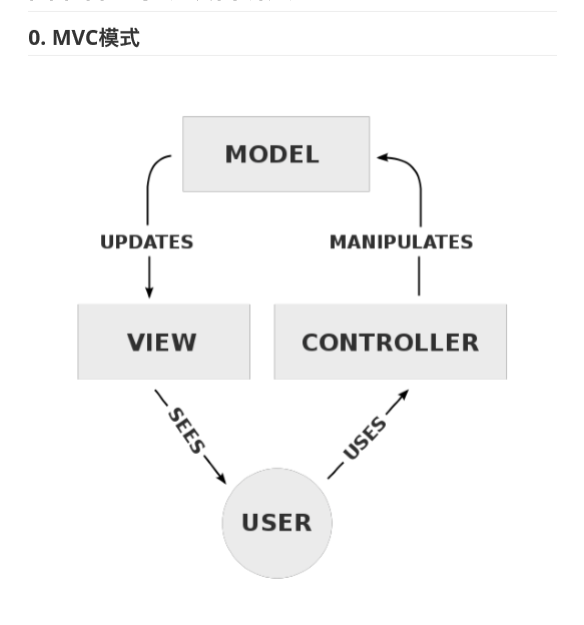
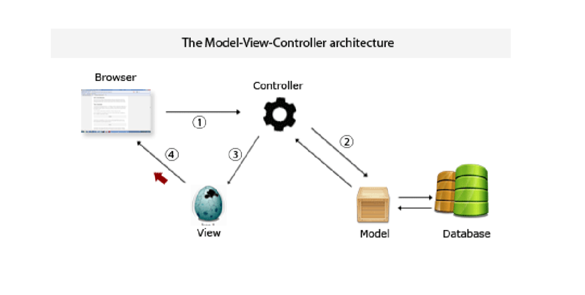

# 第一周 linux 作业

## MVC 模式

M:Model 数据模型
V:View 视图
C:Controller 控制器

### 一个典型的 Web MVC 流程

1. Controller 截取用户发出的请求
2. Controller 调用 Model 完成状态的读写操作
3. Controller 把数据传递给 View
4. View 渲染最终结果并呈现给用户
   

### 数据流:

1. 数据从数据库中拿出来,生成数据模型(Model)
2. Controller 从 Model 中把数据拿出来,放入 View 中
3. 再由浏览器生成界面
4. 用户在浏览器界面中操作,
5. 向 Controller 提交请求
6. 由 Controller 接收到由用户提交过来的数据,将数据写入 Model
7. Model 将数据持久化(写入数据库)

##### View、Model 提供 API,然后由 Controller 来控制什么时候读什么时候写流程由 Controller 控制,视图渲染由 View 控制,读写数据库由 Model 控制

##### Controller 可以有多个,你有几个处理逻辑就有几个 Controller
